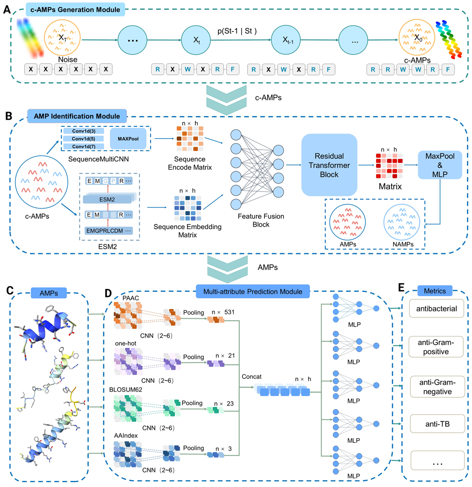

<h2 align="center">  AMP-D3: an integrated framework for intelligent generation, recognition and screening of antimicrobial peptides with contrastive learning and diffusion models </h2>



## 😮 Highlights

### 💡 AMP-D3

- An innovative intelligent framework integrating generation, identification, and screening

### 🔥 PACD - AMPs generation model 

- The PACD generation model incorporates biological prior knowledge into the generation process through diffusion and contrastive learning strategies, enhancing functional specificity

### ⭐ CAST - AMPs identification model

- The CAST identification model employs a cross-modal attention mechanism to fuse high-dimensional features from a pretrained language model (ESM-2) with local sequence information, achieving an identification accuracy of 0.891, a 2.2% improvement over the best existing method

### 🚀 multi-attribute prediction module

- A multi-attribute prediction module evaluates key activities such as antifungal and anticancer properties.

## 📖 Data Preparation

If our paper is accepted, the source codes of the identification model and the generation model will be made public

## 🛠️ Requirements and Installation

* Python == 3.10
* Pytorch == 2.2.0
* CUDA Version == 12.0
* Install required packages:

```bash
git clone git@[github.com/6kongbai/AMP-D3.git]
cd AMP-D3
pip install -r requirements.txt
```

## 🗝️ Inferencing

### 🔥 PACD - AMPs generation model 

Execute PACD/src/sample.py to generate AMPs sequences.

### ⭐ CAST - AMPs identification model

Execute CAST/src/test.py to predict AMPs from test data.

### 🚀 multi-attribute prediction module

Execute AMP-Multi-Feature-Prediction/main.py to predict multi-attribute of AMPs